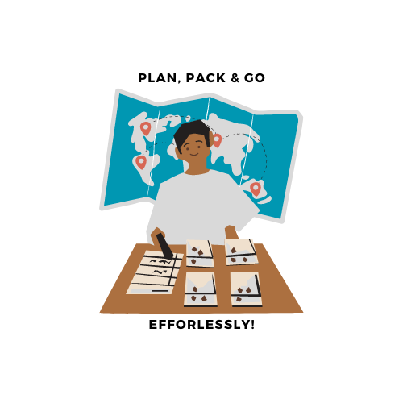
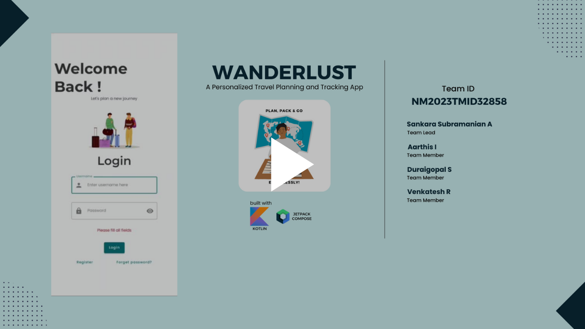
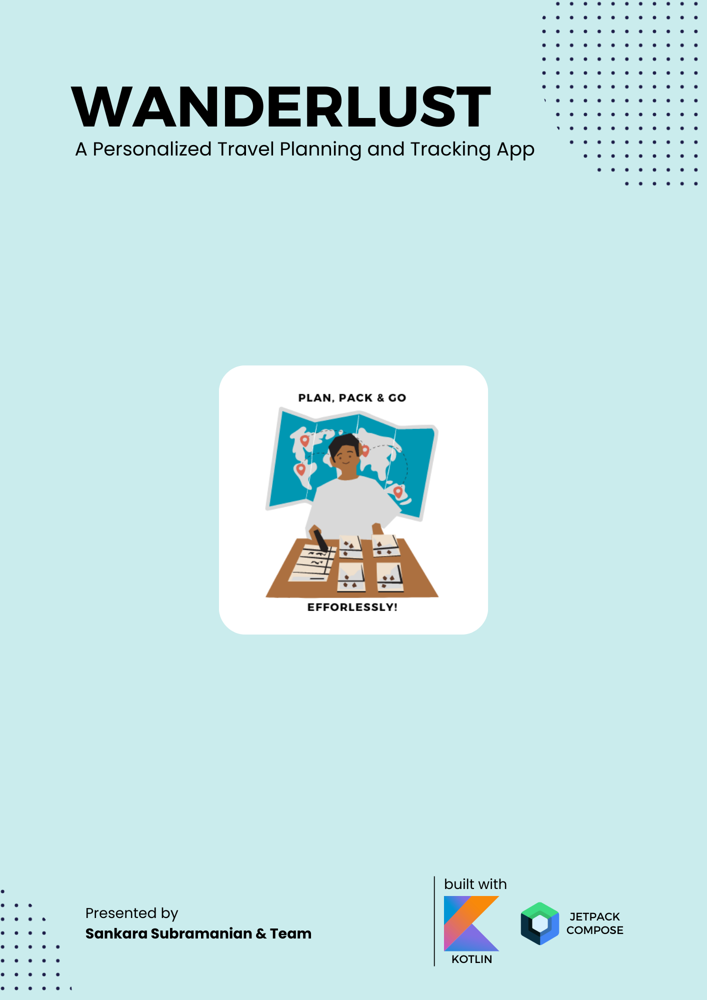

# Wanderlust - A Personalized Travel Planning & Tracking App

Built with

## Team

- Team Id: **NM2023TMID32858**
- Team Members
  - Sankara Subramanian A (Team Lead) [g.dev/devsiva003](https://g.dev/devsiva003)
  - Aarthis I
  - Duraigopal S
  - Vekatesh R

## Project Demonstration

<a href="https://drive.google.com/file/d/1-9KR5cm_pX3LjGDsFh9VZ8U8XQaRyLx-/preview" rel="noopener nofollow" target="_blank" title="Project Report">Click Here To Watch</a>

## Project Report

<a href="https://drive.google.com/file/d/1JZbWwVQTXVJpKq04xGffZiDW3-xa__oD/preview" rel="noopener nofollow" target="_blank" title="Project Report">Click Here To Download</a>

## Other Docs

[Empathy Map](./docs/EmpathyMap_Wanderlust.pdf) 
[Ideation & Brainstorming](./docs/BrainStorming_Wanderlust.pdf)
